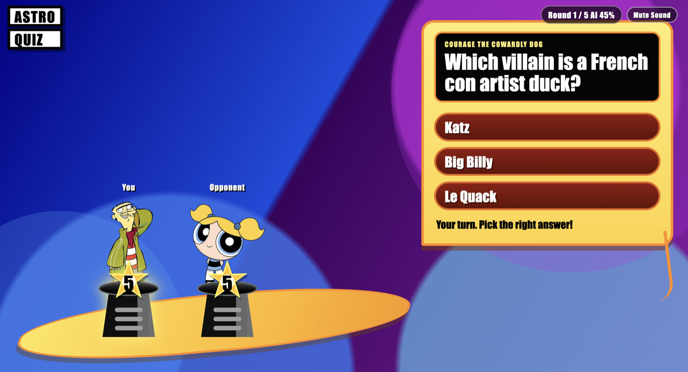
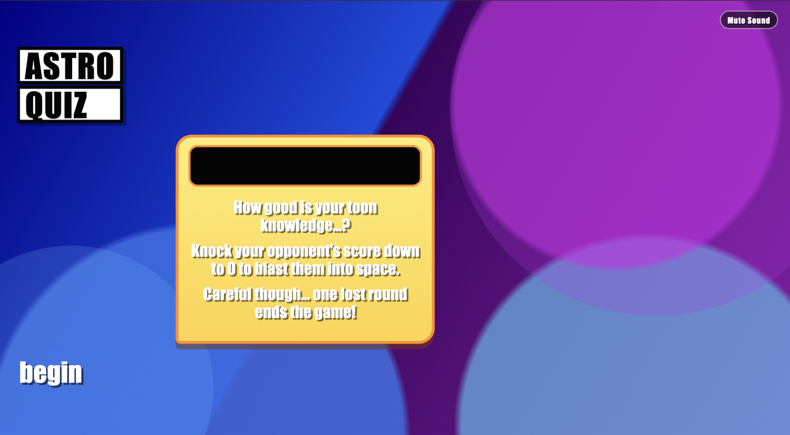
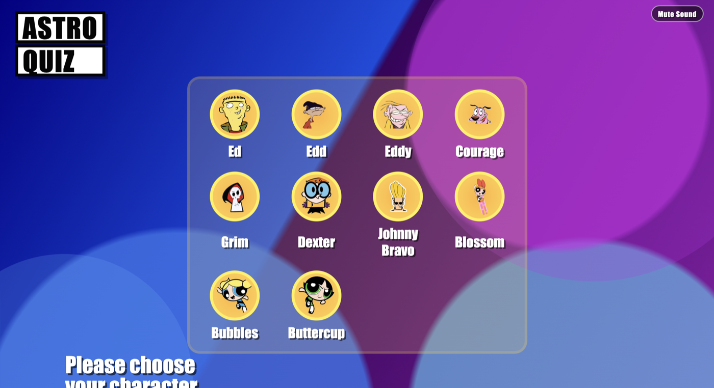
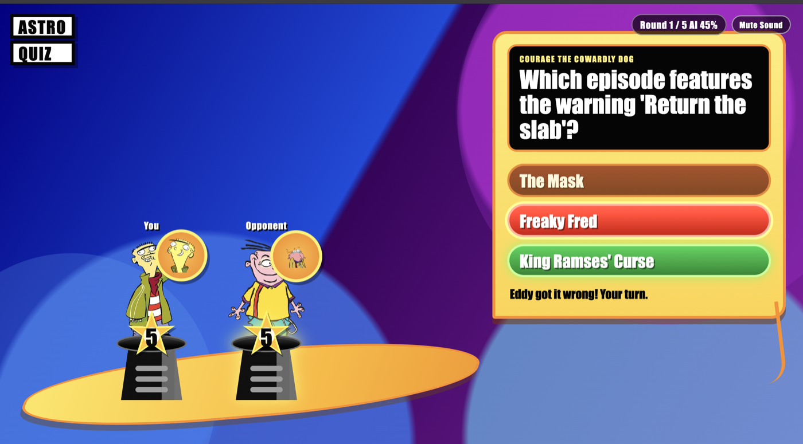
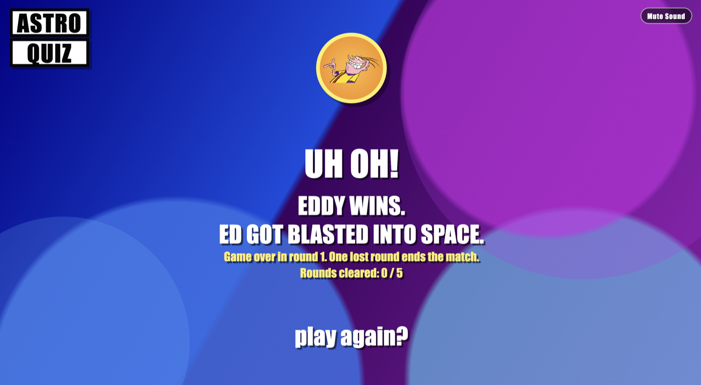

# Astro Quiz Prototype

A fan-made browser quiz game inspired by the old Cartoon Network web games I loved as a kid.

**Live Demo:** https://admirable-semifreddo-905eb8.netlify.app



---

## Why I Built This

When I was younger, Cartoon Network games had a very special kind of magic.

They were simple, colorful, loud, dramatic, and somehow unforgettable. Astro Quiz was one of those games that stayed in my memory — the countdown, the characters, the pressure of choosing the right answer, and the goofy feeling that anything could happen at any moment.

This project is my attempt to recreate a small piece of that feeling.

It is not meant to replace the original game, copy it commercially, or claim ownership over any characters or artwork. It is simply a personal tribute to a childhood memory that made the internet feel fun, strange, and exciting.

---

## About the Game

Astro Quiz Prototype is a React-based quiz battle game where the player chooses a character and faces a series of opponents.

Each round uses a countdown-style life system. Correct answers reduce the opponent’s countdown, while wrong answers give the opponent a chance to fight back. The game includes randomized questions, randomized answer choices, character reactions, sound effects, music, and increasing opponent difficulty.

The goal is simple:

**Survive every round and beat the final opponent.**

---

## Screenshots

### Intro Screen



### Character Selection



### Quiz Battle


### Answer Feedback



### Result Screen



---

## Features

- Character selection screen
- Random opponent selection
- Increasing AI difficulty by round
- Randomized question order
- Randomized answer choices
- No repeated questions in the same run unless the question bank is exhausted
- Countdown-style life system
- Cartoon-style reaction states
- Sound effects and music
- Mute / unmute option
- Round-based elimination
- Frontend-only gameplay
- Deployed with Netlify

---

## Tech Stack

- React
- TypeScript
- Vite
- CSS
- Netlify

---

## Running Locally

Install dependencies:

```bash
npm install
